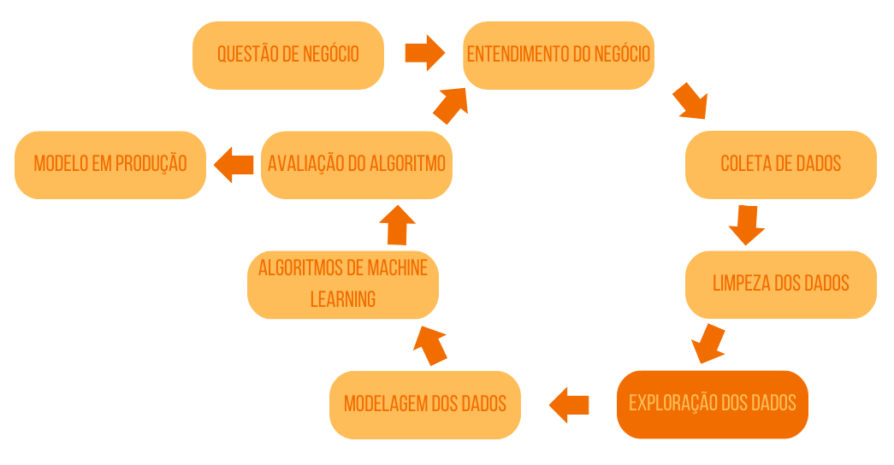
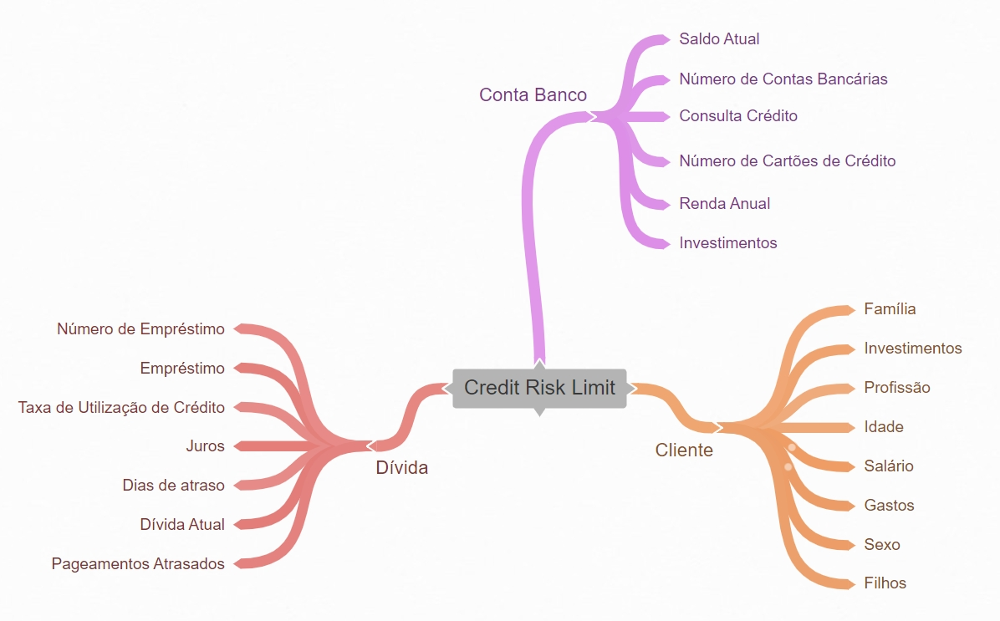

# Limite de cartão de crédito - Classificação

Neste projeto, o objetivo foi desenvolver um modelo de classificação para avaliar os pedidos de aumento de limite de cartão de crédito para o Billion Bank. No momento o banco trabalha com contas digitais e cartões de crédito. 

Atualmente, o cliente solicita o aumento de limite, o banco consulta uma empresa terceira, que retorna "negar" ou "conceder", sendo repassado para o cliente. Essa consulta da empresa terceira pode demorar até 5 dias utéis e como se trata de um serviço, tem custos a cada solicitação feita pelo cliente.

Com isso o banco colocou um regra de que novas solitações podem ser feitas a cada 3 meses, mas assim houve um aumento de churn no ao logo dos semestre, causando preocupação. Em contato com os clientes o motivo do churn foi a burocracia na solicitação de aumento de limite.

Assim, temos dois principais objetivos iniciais: diminuir a burocracia, de forma que o tempo entre uma solicitação e outra seja menor, e que a resposta seja imediata eliminando os serviços de consultas da empresa terceira.

## Ferramentas Utilizadas
Linhaguem: Python  
Ambiente de desenvolvimento: Jupyter Notebook 
Ferramenta de controle de versão: Git 
Bibliotecas: Pandas, Numpy, Seaborn 

## Planejamento da Solução
Usaremos o método cíclico de desenvolvimento CRISP-DS. Irei atualizando conforme o projeto for evoluíndo.

### Coleta de Dados
Os dados são do 3º Hackday da Comunidade DS. Disponível na plataforma Kaggle, <a href ='https://www.kaggle.com/competitions/cdshackdays3'>aqui</a>.

### Limpeza de Dados
Obter o tamanho do dataset que estamos lidando, tipos de dados, checar dados faltantes e estatística descritiva.

### Exploração dos Dados
Na seção de Feature Engineering criado o mapa mental de hipóteses, criada as hipóteses.

## Próximos Passos
* Rever hipóteses criadas e analisar, se necessário derivar variáveis.
* Filtragem de variáveis
* Análise Exploratória
* Preparação dos Dados
* Seleção de atributos
* Modelo de Machine Learning
* Fine Tuning
* Métricas de Perfomance
